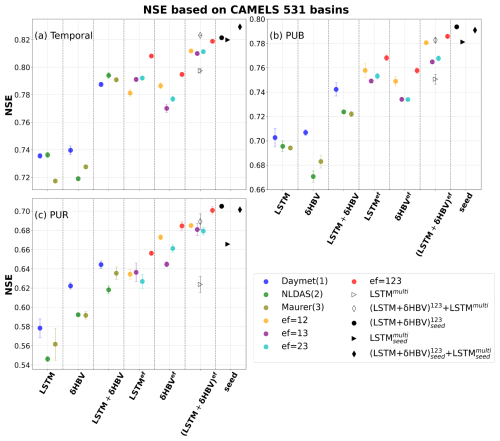
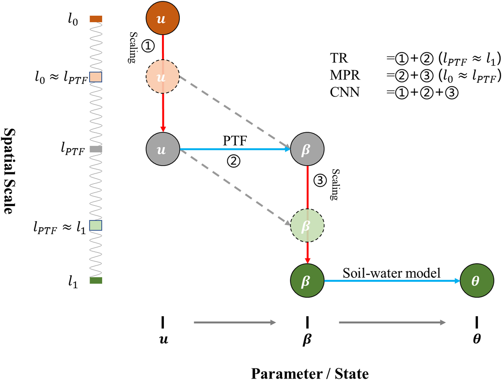
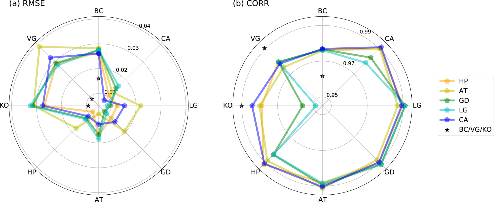

Journal articles
======
(For a full list, please refer to my <a href="https://scholar.google.com/citations?user=bIzYQukAAAAJ&hl=en" target="_blank">Google Scholar</a> and <a href="https://www.researchgate.net/profile/Peijun-Li-3" target="_blank">Researchgate</a>

1. **Li, P.**, Song, Y., Pan, M., Lawson, K., & Shen, C. (2025). Ensembling differentiable process-based and data-driven models with diverse meteorological forcing datasets to advance streamflow simulation. **Hydrology and Earth System Sciences**, 29(23), 6829–6861. [https://doi.org/10.5194/hess-29-6829-2025](https://doi.org/10.5194/hess-29-6829-2025).
>This study explores how combining different model types improves streamflow predictions, especially in data-sparse scenarios. By integrating two highly accurate models with distinct mechanisms and leveraging multiple meteorological datasets, we highlight their unique strengths and set **[new accuracy benchmarks](https://doi.org/10.5281/zenodo.16895228)** in the [CAMELS dataset](https://doi.org/10.5065/D6MW2F4D) across spatiotemporal conditions. Our findings enhance the understanding of how diverse models and multi-source data can be effectively used to improve hydrological predictions.

1. **Li P**, Zha Y, Zhang Y, et al. (2024). Deep learning integrating scale conversion and pedo‐transfer function to avoid potential errors in cross‐scale transfer[J]. ***Water Resources Research***, 60(3): e2023WR035543. [https://doi.org/10.1029/2023WR035543](https://doi.org/10.1029/2023WR035543).
>This study tackles a common challenge in hydrological modeling: errors that arise when transferring model parameters across spatial scales (e.g., from local to regional scales). We propose a deep learning–based approach that integrates scale conversion and pedo-transfer functions (PTFs) directly within a single model. Traditional methods separate these steps and often introduce errors due to mismatched scales. The proposed convolutional neural network (CNN) learns the mapping from different scale static soil/landscape attributes to specific-scale hydrological parameters of the following physically-based model, automatically handling the scale discrepancy in **[a differentiable framework](https://dataverse.harvard.edu/dataset.xhtml?persistentId=doi:10.7910/DVN/8VJDPT)**. This integrated strategy reduces errors in cross-scale parameter transfer and improves the quality and robustness of soil moisture predictions, as shown in both synthetic and real-world tests.  
<!-- {:.width-50} -->
<!--   
 -->
  

1. **Li, P.**, Zha, Y., Zuo, B., & Zhang, Y. (2023). A family of soil water retention models based on sigmoid functions. ***Water Resources Research***, 59, e2022WR033160. [https://doi.org/10.1029/2022WR033160](https://doi.org/10.1029/2022WR033160).
>In this study, we developed a new family of soil water retention models—mathematical formulas that describe how water is held in soil at different moisture levels. Soil water retention curves are fundamental for understanding water movement, plant water availability, and soil-water interactions in hydrology and agriculture. Traditionally, existing equations sometimes struggle to fit data well across the full range of soil moisture, especially near very dry or very wet conditions. We proposed **[a flexible set of models based on sigmoid functions](https://dataverse.harvard.edu/dataset.xhtml?persistentId=doi:10.7910/DVN/L0XVBG)** that can more accurately and smoothly represent soil water retention across the entire moisture range. These models improve on existing ones by offering better fit quality, fewer fitting issues, and a consistent mathematical structure that makes them easier to apply in hydrologic and environmental modeling. Our results show that this new family of models performs well across diverse soil types and can help improve predictions of soil water behavior in hydrologic simulations.

2. **Li, P.**, Zha, Y., Shi, L., Tso, C. H. M., Zhang, Y., & Zeng, W. (2020). Comparison of the use of a physical-based model with data assimilation and machine learning methods for simulating soil water dynamics. ***Journal of Hydrology***, 584, 124692. [https://doi.org/10.1016/j.jhydrol.2020.124692](https://doi.org/10.1016/j.jhydrol.2020.124692)  
>In this work, we compared a traditional physically-based soil water model with data assimilation to several machine learning models for simulating how soil moisture changes over time. We found that the physically-based model (solving Richards’ equation with data assimilation) was more sensitive to uncertainties in soil conditions and boundary settings, while the machine learning models were less affected by these physical assumptions. However, the machine learning models had difficulty capturing sharp peaks and troughs in soil moisture. Overall, each approach has its strengths and weaknesses, and machine learning offers robustness and lower computational cost, whereas the physical model’s performance depends on good prior information about soil properties.
<!-- <imag src="images/publications/ANN_IES_1.png" width="600">  
<imag src="images/publications/ANN_IES_2.png" width="600">  
<imag src="images/publications/ANN_IES_3.png" width="600"> -->

3. **Li, P.**, Zha, Y., Tso, C. H. M., Shi, L., Yu, D., Zhang, Y., & Zeng, W. (2020). Data assimilation of uncalibrated soil moisture measurements from frequency-domain reflectometry. ***Geoderma***, 374, 114432. [https://doi.org/10.1016/j.geoderma.2020.114432](https://doi.org/10.1016/j.geoderma.2020.114432)
>In this study, we developed a calibration-free approach to improve soil moisture measurements from common sensors. These sensors are widely used but usually need site-specific calibration, which is time-consuming and costly. We combined simple bias-correction models with data assimilation techniques (Kalman filter and smoother) to automatically correct sensor errors using only meteorological data. This method allows soil moisture data to be calibrated without field experiments and can also be applied to future measurements in real time.

4. **Li, P.**, Zha, Y., & Tso, C.-H. M. (2023). Reconstructing GRACE-derived terrestrial water storage anomalies with in-situ groundwater level measurements and meteorological forcing data. ***Journal of Hydrology: Regional Studies***, 50, 101528. [https://doi.org/10.1016/j.ejrh.2023.101528](https://doi.org/10.1016/j.ejrh.2023.101528)
>In this study, we reconstructed satellite-based (GRACE) terrestrial water storage changes by combining groundwater level observations and meteorological information. This **[approach](https://github.com/PercyLeeMaxWell/ReconstructedTWS)** is designed for regions where human activities strongly affect groundwater and make model estimates unreliable. By addressing scale mismatch and separating long-term trends from short-term variations, we showed that groundwater data can significantly improve reconstructed water storage, especially for long-term trends, and better reveal human impacts on water resources.  

5. **Li, P.**, Zha, Y., Shi, L., & Zhong, H. (2021). Identification of the terrestrial water storage change features in the North China Plain via independent component analysis. ***Journal of Hydrology: Regional Studies***, 38, 100955. [https://doi.org/10.1016/j.ejrh.2021.100955](https://doi.org/10.1016/j.ejrh.2021.100955)
>In this study, we used satellite observations and statistical techniques to identify different components of water storage change in the North China Plain, highly affected by human activities and groundwater withdrawal. By applying independent component analysis to GRACE data, we separated surface water and shallow and deep groundwater signals. This allowed us to better understand how natural variability and human activities affect water storage differently over time, revealing clear shifts in groundwater use linked to human interventions.
  

6. **Li, P.**, Zha, Y., Shi, L., & Zhong, H. (2022). Assessing the Global Relationships Between Teleconnection Factors and Terrestrial Water Storage Components. ***Water Resources Management***, 36, 119–133. [https://doi.org/10.1007/s11269-021-03015-x](https://doi.org/10.1007/s11269-021-03015-x)
>In this study, we explored how large-scale climate patterns influence global water storage and its components. Using satellite data and hydrological models, we examined the links between major ocean-related climate oscillations and different parts of terrestrial water storage. We found that a few dominant climate drivers, especially ENSO and AMO, play a key role in controlling global water storage changes, with particularly strong impacts on groundwater. These results help clarify how climate variability shapes water resources worldwide.

<!-- 7. Yin, W., Yang, S., Hu, L., Tian, S., Wang, X., Zhao, R., & **Li, P.** (2022). Improving understanding of spatiotemporal water storage changes over China based on multiple datasets. ***Journal of Hydrology***, 612, 128098. [https://doi.org/10.1016/j.jhydrol.2022.128098](https://doi.org/10.1016/j.jhydrol.2022.128098) -->

Conferences
======
(For a full list, please refer to my <a href="https://scholar.google.com/citations?user=bIzYQukAAAAJ&hl=en" target="_blank">Google Scholar</a>)
* **Li, P.**, Zha, Y., Tso, C. H. M., Shi, L., Yu, D., Zhang, Y., Zeng, W., Peng, J. (2023) Bias detection of ISMN soil moisture measurements through soil water balance model and data assimilation. EGU General Assembly 2023, Vienna, Austria.
